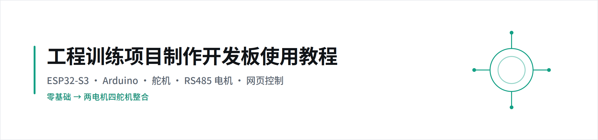
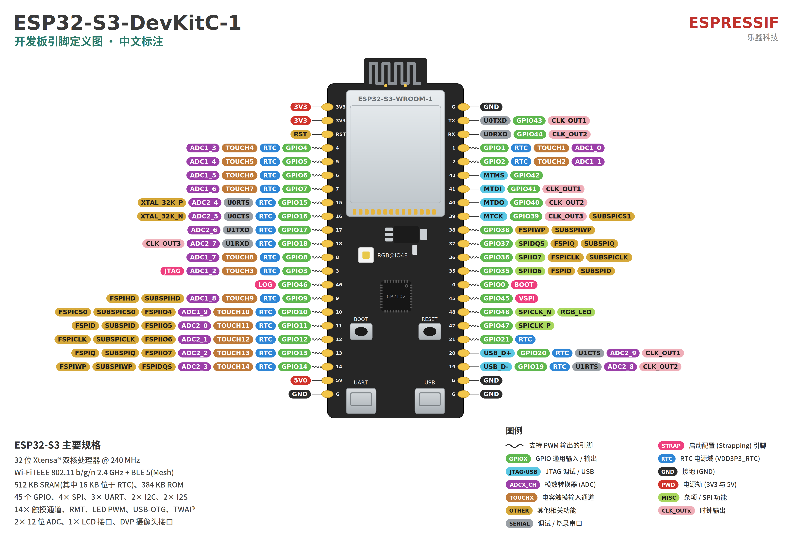
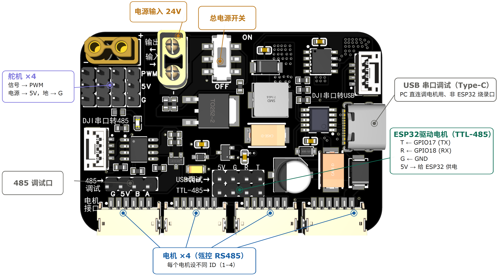

<div align="center">

<picture>
  <source media="(prefers-color-scheme: dark)" srcset="assets/banner-dark.png">
  
</picture>

**面向零基础学生的 ESP32-S3 开发板使用教程**

[快速开始](#快速开始三步) · [学习路线](教程文档/00_learning_path.md) · [硬件资料](教程文档/06_hardware_info.md) · [常见问题](教程文档/FAQ_troubleshooting.md) · [Gitee 镜像](https://gitee.com/careyyyy/engineering-training)

</div>

---

面向**零基础**学习者：从环境搭建，到舵机与 MG4010-i10 RS485 电机控制，再到网页远程控制和「两电机四舵机」整合工程。

> [!TIP]
> **第一次来，别翻代码目录。** 直接点下面这一步，按学习路线从头走，每一步都有「完成标志」帮你确认没跳步：
>
> ### [从第 1 步开始学 —— 00 学习路线](教程文档/00_learning_path.md)

---

## 快速开始（三步）

1. **装环境**：[Windows 安装](教程文档/01_install_windows.md) ・ [macOS 安装](教程文档/02_install_macos.md) ・ [下载链接与驱动](教程文档/00_downloads_cn.md) ・ [板卡参数](教程文档/03_board_settings_esp32s3.md)
2. **跟路线**：打开 [00 学习路线](教程文档/00_learning_path.md)，从第 1 步顺序往下走。
3. **卡住了**：先查 [常见问题排查 FAQ](教程文档/FAQ_troubleshooting.md)，再看本页底部的 [安全须知](#安全须知必读)。

---

## 学习路线（按这个顺序走）

> 下面是总览，**完整步骤、接线和「完成标志」以 [00 学习路线](教程文档/00_learning_path.md) 为准。**

| 阶段 | 目标 | 教程 | 示例代码 |
|:--:|------|------|----------|
| 1 | 装好 Arduino IDE 和 ESP32-S3 板卡 | [Windows](教程文档/01_install_windows.md) / [macOS](教程文档/02_install_macos.md) | — |
| 2 | 让板载 RGB 彩灯闪烁，验证上传流程 | [学习路线](教程文档/00_learning_path.md) | [01_LED闪烁](示例代码/01_LED闪烁/01_blink_onboard_led.ino) |
| 3 | 学会串口输出和调试 | [学习路线](教程文档/00_learning_path.md) | [02_串口调试](示例代码/02_串口调试/02_serial_print.ino) |
| 4 | 控制单个 PWM 舵机 | [舵机指南](教程文档/07_servo_guide.md) | [03_舵机基础控制](示例代码/03_舵机基础控制/03_servo_basic.ino) |
| 5 | 用网页控制舵机 | [网页控制舵机](教程文档/05_web_servo_guide.md) | [04_舵机网页控制](示例代码/04_舵机网页控制/04_servo_web_control.ino) |
| 6 | 跑通 MG4010-i10 基础命令 | [电机指南](教程文档/08_motor_guide.md) | [05_电机基础控制](示例代码/05_电机基础控制/05_mg4010_motor_basic.ino) |
| 7 | 电机速度闭环控制 | [电机指南](教程文档/08_motor_guide.md) | [06_电机速度模式](示例代码/06_电机速度模式/06_motor_speed_mode.ino) |
| 8 | 电机多圈位置控制 | [电机指南](教程文档/08_motor_guide.md) | [07_电机位置模式](示例代码/07_电机位置模式/07_motor_position_mode.ino) |
| 9 | 网页综合控制电机 | [电机指南](教程文档/08_motor_guide.md) | [08_电机网页控制](示例代码/08_电机网页控制/08_motor_web_control.ino) |
| 10 | 两电机四舵机整合 | [机器人整合](教程文档/09_robot_integration.md) | [09_机器人整合控制](示例代码/09_机器人整合控制/09_robot_integrated_control.ino) |

---

## 你需要准备

| 物品 | 用途 |
|------|------|
| ESP32-S3 开发板 + USB 数据线 | 主控；数据线必须能传数据，不能只用充电线 |
| 普通 PWM 舵机 + 独立 5V 电源 | 学习 50Hz PWM 控制 |
| MG4010-i10 RS485 电机 + 12~24V 电源 | 学习 RS485 电机控制 |
| RS485 / 供电转接板（推荐） | 连接 ESP32、电机电源与电机 |

---

## 安全须知（必读）

> [!CAUTION]
> 上电前务必确认以下四条，否则可能烧板、烧电源或失控伤人：
> 1. 舵机和电机**不能**从 ESP32 的 3.3V 引脚取电，必须用独立电源。
> 2. ESP32 GND、转接板 GND、电机电源负极、舵机电源负极**必须共地**。
> 3. 第一次测试电机先**低速、小角度、空载**。
> 4. 出现发热、异响、复位、失控时**立即断电**。

---

## 示例代码索引

| 编号 | 示例 | 说明 |
|:--:|------|------|
| 01 | [LED 闪烁](示例代码/01_LED闪烁/01_blink_onboard_led.ino) | 不接线，验证 IDE、板卡、端口和上传。板载 WS2812B RGB 彩灯 |
| 02 | [串口调试](示例代码/02_串口调试/02_serial_print.ino) | 学会用 `Serial.println()` 看程序状态 |
| 03 | [舵机基础控制](示例代码/03_舵机基础控制/03_servo_basic.ino) | 串口输入角度，控制单个舵机 |
| 04 | [舵机网页控制](示例代码/04_舵机网页控制/04_servo_web_control.ino) | 网页按钮控制舵机角度 |
| 05 | [电机基础控制](示例代码/05_电机基础控制/05_mg4010_motor_basic.ino) | MG4010 运行、停止、清错、读状态 |
| 06 | [电机速度模式](示例代码/06_电机速度模式/06_motor_speed_mode.ino) | 输入目标速度，低速正反转测试 |
| 07 | [电机位置模式](示例代码/07_电机位置模式/07_motor_position_mode.ino) | 输入目标角度，多圈位置闭环 |
| 08 | [电机网页控制](示例代码/08_电机网页控制/08_motor_web_control.ino) | 网页切换速度/位置模式 |
| 09 | [机器人整合控制](示例代码/09_机器人整合控制/09_robot_integrated_control.ino) | 两个 RS485 电机 + 四个 PWM 舵机 |

进阶示例说明文档：[05](示例代码/05_电机基础控制/README.md) ・ [06](示例代码/06_电机速度模式/README.md) ・ [07](示例代码/07_电机位置模式/README.md) ・ [08](示例代码/08_电机网页控制/README.md) ・ [09](示例代码/09_机器人整合控制/README.md)

---

<details>
<summary><b>开发板说明与默认引脚</b>（点开查看）</summary>

<br>

本教程使用 ESP32-S3 开发板作为主控制器，按 ESP32-S3-DevKitC-1 类开发板组织。实际配发板在 USB 接口、丝印或外设数量上可能略有差异，接线以板上丝印、[开发板引脚图](硬件资料/接线图/ESP32-S3开发板引脚图.png) 和 [原理图](硬件资料/技术文档/ESP32-S3原理图.pdf) 为准。

<div align="center">
  
</div>

**默认引脚**

| 功能 | 默认 GPIO | 说明 |
|------|-----------|------|
| 板载 WS2812B RGB 彩灯 | GPIO48 | 开发板自带，不需要外接 |
| RS485 TX | GPIO17 | 接转接板 TTL-485 调试口 `T`；通用模块接 `DI` |
| RS485 RX | GPIO18 | 接转接板 TTL-485 调试口 `R`；通用模块接 `RO` |
| RS485 DE/RE | GPIO16 | 仅用散装 RS485 模块时需要；课程转接板不接 |
| 舵机 1-4 | GPIO10 / 11 / 12 / 13 | 只接信号线，舵机电源必须独立 5V |

> [!NOTE]
> 部分 ESP32-S3-WROOM 模组会占用 GPIO35/36/37 作为内部 flash/PSRAM 通信，外部不可用。本教程默认使用的 GPIO10、11、12、13、16、17、18、48 已按课程资料核对。

参考：Espressif 官方 [ESP32-S3-DevKitC-1 用户指南](https://docs.espressif.com/projects/esp-dev-kits/zh_CN/latest/esp32s3/esp32-s3-devkitc-1/user_guide_v1.1.html)。

</details>

<details>
<summary><b>接线图与硬件资料</b>（点开查看）</summary>

<br>

<div align="center">
  
</div>

| 类别 | 资源 |
|------|------|
| 开发板引脚图 | [ESP32-S3开发板引脚图.png](硬件资料/接线图/ESP32-S3开发板引脚图.png) |
| 转接板接线标注 | [PNG](硬件资料/接线图/电机转接板接线标注.png) ・ [SVG 源文件](硬件资料/接线图/电机转接板接线标注.svg) |
| 转接板实物图 | [电机转接板实物图.png](硬件资料/接线图/电机转接板实物图.png) |
| 技术规格书 | [ESP32-S3技术规格书.pdf](硬件资料/技术文档/ESP32-S3技术规格书.pdf) |
| 开发板原理图 | [ESP32-S3原理图.pdf](硬件资料/技术文档/ESP32-S3原理图.pdf) |
| 电机手册 / 协议 | [手册](硬件资料/技术文档/MG4010-i10电机手册.pdf) ・ [RS485 协议](硬件资料/技术文档/MG4010-i10-R485协议.pdf) |
| 转接板原理图 | [转接板原理图.pdf](硬件资料/技术文档/转接板原理图.pdf) |
| Windows 串口驱动 | [CH341SER.EXE](硬件资料/驱动程序/CH341SER.EXE) |
| 3D 模型 | [开发板](硬件资料/3D模型/开发板/ESP32-S3开发板.STEP) ・ [电机](硬件资料/3D模型/电机/MG4010-i10电机.STEP) ・ [转接板](硬件资料/3D模型/转接板/电机转接板.STEP) ・ [舵机](硬件资料/3D模型/舵机/MG90S舵机主体.STEP) ・ 舵盘 [单](硬件资料/3D模型/舵机/单向舵盘.STEP)/[双](硬件资料/3D模型/舵机/双向舵盘.STEP)/[四](硬件资料/3D模型/舵机/四向舵盘.STEP) |

更多说明见 [硬件资料 README](硬件资料/README.md)。

</details>

<details>
<summary><b>安装要点与推荐参数</b>（点开查看）</summary>

<br>

国内安装 ESP32 板卡包，开发板管理器里使用 Espressif 国内镜像：

```text
https://jihulab.com/esp-mirror/espressif/arduino-esp32/-/raw/gh-pages/package_esp32_index_cn.json
```

安装带 `-cn` 后缀的 `esp32 by Espressif Systems`。详细步骤见 [Windows 安装教程](教程文档/01_install_windows.md)。

推荐 ESP32-S3 参数：

```text
Board: ESP32S3 Dev Module
Upload Speed: 460800
USB CDC On Boot: Enabled
CPU Frequency: 240MHz
Flash Mode: QIO 或 DIO
Partition Scheme: Default
```

> [!TIP]
> 上传失败时，把 `Upload Speed` 改成 `115200`，或按住 `BOOT` 后再上传。

</details>

<details>
<summary><b>目录结构</b></summary>

```text
engineering-training/
├── README.md
├── 教程文档/
├── 示例代码/
└── 硬件资料/
    ├── 技术文档/
    ├── 驱动程序/
    ├── 接线图/
    └── 3D模型/
```

</details>

---

> [!NOTE]
> **国内访问更快**：本仓库在 Gitee 有镜像 —— https://gitee.com/careyyyy/engineering-training ，给校园网/家庭网的学生发 Gitee 链接更稳。
> 有问题或建议，欢迎在 Issues 反馈。
